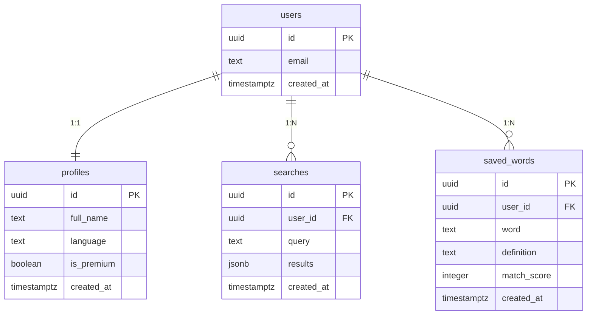

<div align="center">

# 🧠 I HAVE A WORD — יש לי מילה

### מצא את המילה ש"על קצה הלשון" — בעזרת AI

תאר מילה במילים שלך, וה-AI (Claude) יחזיר עד **6 מילים מועמדות** מדורגות לפי **אחוז התאמה**, כל אחת עם הגדרה והסבר קצר. בעברית ובאנגלית.

`Vite + React` · `Supabase` · `Claude (Anthropic)` · `Vercel`

🔗 **דמו חי:** _https://YOUR-APP.vercel.app_

</div>

---

## 🎯 הבעיה

כולנו מכירים את התופעה: אתה **יודע בדיוק למה אתה מתכוון** אבל המילה המדויקת בורחת — "על קצה הלשון" (*tip of the tongue*). הכלים הקיימים לא נבנו לבעיה הזו: מילון דורש שכבר תדע את המילה, ותזאורוס דורש מילת מוצא.

## 💡 הפתרון

**I HAVE A WORD** הופך את התהליך: מתארים את המשמעות בשפה חופשית, וה-AI מבצע "חיפוש הפוך" — מהמשמעות אל המילה. מוצגות כמה מועמדות **מדורגות באחוזים** עם הסבר לכל אחת. אפשר לשמור מילים ולחזור להיסטוריה.

## 👥 קהל היעד

כותבים, קופירייטרים ואנשי תוכן · סטודנטים ואקדמאים · עולים חדשים ולומדי עברית/אנגלית · כל מי שנתקל ברגע ה"על קצה הלשון".

## 🆚 מתחרים ובידול

| הפתרון הקיים | מה הוא נותן | החיסרון מול I HAVE A WORD |
|---|---|---|
| **מילון רגיל** | מילה ← הגדרה | דורש לדעת את המילה מראש; אין חיפוש הפוך |
| **תזאורוס** | מילים נרדפות | צריך מילת מוצא |
| **חיפוש בגוגל** | תוצאות חופשיות | לא ממוקד; ללא דירוג או שמירה |
| **לשאול ChatGPT ישירות** | תשובת AI כללית | ללא דירוג באחוזים, ללא היסטוריה/שמירה, לא ממוקד בעברית |
| **מילון הפוך (OneLook)** | reverse dictionary | מתמקד באנגלית, חלש בעברית |

**הבידול:** ממוקד-עברית, מציג כמה מועמדות **מדורגות באחוזים + נימוק**, עם שמירה והיסטוריה, בחוויה אחת נקייה — וחינמי. הסוד (מפתח ה-AI) מוסתר בצד השרת.

## ✨ תכונות עיקריות

- 🔎 **חיפוש מילה ב-AI** — תיאור חופשי → עד 6 מילים מדורגות + הגדרה + נימוק.
- 🌐 **עברית ואנגלית** (זיהוי שפה אוטומטי).
- 💾 **שמירת מילים** והיסטוריית חיפושים אישית.
- 🔐 **התחברות / הרשמה**, "שכחתי סיסמה" ואיפוס.
- ⚙️ **הגדרות** — שינוי סיסמה (עם אימות הסיסמה הנוכחית) ושם תצוגה.
- 📱 **RTL + responsive**.

## 🏗️ ארכיטקטורה

```
[ דפדפן: React ]
      │  תיאור המילה
      ▼
[ Supabase Edge Function: find-words ]  ◄── מפתח Claude מוסתר כאן (בשרת)
      │  קריאה מאובטחת
      ▼
[ Claude (Anthropic) API ]
      │  JSON: 6 מילים + אחוז + נימוק
      ▼
[ React → תצוגת תוצאות ]   +   [ Supabase Postgres: שמירת חיפוש/מילים ]
```

מפתח ה-AI **לעולם אינו מגיע לדפדפן** — הדפדפן קורא ל-Edge Function (`supabase.functions.invoke`), וה-Function (בשרת) קורא ל-Claude עם המפתח הסודי.

## 🔐 אבטחה

- 🔒 **מפתח Claude מוסתר בשרת** — נשמר כ-Secret ב-Supabase (`ANTHROPIC_API_KEY`), לעולם לא בדפדפן או ב-Git. ✓
- **RLS** על כל הטבלאות — כל משתמש ניגש רק לשורות שלו (`auth.uid() = user_id`).
- **הרשאות מינימום** — `anon` מבוטל; ל-`authenticated` רק הדרוש.
- **Edge Function מוקשח** — אימות והגבלת קלט, הגבלת עלות (`max_tokens`), שגיאות גנריות, CORS allowlist, הגנת prompt-injection.
- **שינוי סיסמה** מאמת תחילה את הסיסמה הנוכחית (re-authentication).

## 🗄️ מודל הנתונים (ERD)



**הסכמה להרצה ב-Supabase (SQL Editor):**

```sql
-- ============================================================================
--  I HAVE A WORD  —  סכימת מסד הנתונים (Supabase / PostgreSQL)
--  גרסה מוקשחת אבטחתית (security-hardened)
-- ----------------------------------------------------------------------------
--  איך מריצים:
--  1. Supabase -> הפרויקט שלך -> תפריט שמאלי -> "SQL Editor".
--  2. "New query", הדבק את כל הקובץ, ולחץ "Run".
--
--  עקרונות אבטחה כאן:
--   - RLS (Row Level Security) על כל טבלה: כל משתמש רואה/עורך רק את שלו.
--   - הרשאות מינימום (least privilege): גישת anon (לא-מחובר) מבוטלת לחלוטין
--     לטבלאות הנתונים; ל-authenticated רק ההרשאות שהאפליקציה צריכה.
--   - אילוצי CHECK על אורך/טווח שדות (הגנה מפני נתונים חריגים/שימוש לרעה).
--
--  בטוח להרצה חוזרת.
-- ============================================================================


-- ---------------------------------------------------------------------------
-- 1) profiles — פרופיל אחד לכל משתמש (נוצר אוטומטית בהרשמה, ראה טריגר למטה)
-- ---------------------------------------------------------------------------
create table if not exists public.profiles (
  id          uuid        primary key references auth.users (id) on delete cascade,
  full_name   text        check (full_name is null or char_length(full_name) <= 120),
  language    text        not null default 'he' check (language in ('he','en')),
  is_premium  boolean     not null default false,
  created_at  timestamptz not null default now()
);


-- ---------------------------------------------------------------------------
-- 2) searches — היסטוריית חיפושים + התוצאות שה-AI החזיר
-- ---------------------------------------------------------------------------
create table if not exists public.searches (
  id          uuid        primary key default gen_random_uuid(),
  user_id     uuid        not null references auth.users (id) on delete cascade,
  query       text        not null check (char_length(query) between 1 and 1000),
  results     jsonb       not null default '[]',
  created_at  timestamptz not null default now()
);
create index if not exists searches_user_id_created_idx
  on public.searches (user_id, created_at desc);


-- ---------------------------------------------------------------------------
-- 3) saved_words — מילים שהמשתמש שמר
-- ---------------------------------------------------------------------------
create table if not exists public.saved_words (
  id           uuid        primary key default gen_random_uuid(),
  user_id      uuid        not null references auth.users (id) on delete cascade,
  word         text        not null check (char_length(word) between 1 and 200),
  definition   text        check (definition is null or char_length(definition) <= 1000),
  match_score  integer     check (match_score is null or (match_score between 0 and 100)),
  created_at   timestamptz not null default now()
);
create index if not exists saved_words_user_id_created_idx
  on public.saved_words (user_id, created_at desc);


-- ============================================================================
--  אבטחה: Row Level Security (RLS)
-- ============================================================================
alter table public.profiles    enable row level security;
alter table public.searches    enable row level security;
alter table public.saved_words enable row level security;

-- ---- profiles ----
drop policy if exists "profiles_select_own" on public.profiles;
create policy "profiles_select_own" on public.profiles
  for select using (auth.uid() = id);

drop policy if exists "profiles_update_own" on public.profiles;
create policy "profiles_update_own" on public.profiles
  for update using (auth.uid() = id) with check (auth.uid() = id);

drop policy if exists "profiles_insert_own" on public.profiles;
create policy "profiles_insert_own" on public.profiles
  for insert with check (auth.uid() = id);

-- ---- searches ----
drop policy if exists "searches_select_own" on public.searches;
create policy "searches_select_own" on public.searches
  for select using (auth.uid() = user_id);

drop policy if exists "searches_insert_own" on public.searches;
create policy "searches_insert_own" on public.searches
  for insert with check (auth.uid() = user_id);

drop policy if exists "searches_delete_own" on public.searches;
create policy "searches_delete_own" on public.searches
  for delete using (auth.uid() = user_id);

-- ---- saved_words ----
drop policy if exists "saved_words_select_own" on public.saved_words;
create policy "saved_words_select_own" on public.saved_words
  for select using (auth.uid() = user_id);

drop policy if exists "saved_words_insert_own" on public.saved_words;
create policy "saved_words_insert_own" on public.saved_words
  for insert with check (auth.uid() = user_id);

drop policy if exists "saved_words_delete_own" on public.saved_words;
create policy "saved_words_delete_own" on public.saved_words
  for delete using (auth.uid() = user_id);


-- ============================================================================
--  הרשאות מינימום (Least Privilege)
--  מבטלים כל גישה למשתמש לא-מחובר (anon), ונותנים ל-authenticated רק את
--  פעולות ה-DML שהאפליקציה באמת מבצעת. ה-RLS עדיין מסנן שורות לפי משתמש.
-- ============================================================================
revoke all on public.profiles    from anon;
revoke all on public.searches    from anon;
revoke all on public.saved_words from anon;

grant select, insert, update on public.profiles    to authenticated;
grant select, insert, delete on public.searches    to authenticated;
grant select, insert, delete on public.saved_words to authenticated;


-- ============================================================================
--  טריגר: יצירת פרופיל אוטומטית בכל הרשמה
-- ============================================================================
create or replace function public.handle_new_user()
returns trigger
language plpgsql
security definer
set search_path = public
as $$
begin
  insert into public.profiles (id, full_name)
  values (new.id, coalesce(new.raw_user_meta_data ->> 'full_name', ''))
  on conflict (id) do nothing;
  return new;
end;
$$;

drop trigger if exists on_auth_user_created on auth.users;
create trigger on_auth_user_created
  after insert on auth.users
  for each row execute function public.handle_new_user();

-- ============================================================================
--  הערת ייצור (production):
--   • הפעל אישור דוא"ל: Authentication -> Providers -> Email -> "Confirm email".
--   • שקול הגבלת קצב/מכסה יומית לחיפושים (ראה SECURITY.md).
-- ============================================================================
```

## 🔌 שירותים חיצוניים ואינטגרציות

| שירות | סוג | למה משמש |
|---|---|---|
| **Supabase Auth** | אוטנטיקציה | הרשמה, התחברות, איפוס/שינוי סיסמה |
| **Supabase PostgreSQL** | מסד נתונים | פרופילים, חיפושים, מילים שמורות (עם RLS) |
| **Supabase Edge Functions** | לוגיקת שרת | קריאה מאובטחת ל-Claude — **הסתרת מפתח ה-API** |
| **Claude (Anthropic) API** | קריאת API / AI | ניתוח התיאור והחזרת מילים מדורגות |
| **Vercel** | אירוח / Deployment | פרסום ה-Frontend |

## ⚙️ משתני סביבה וסודות

**ב-Vercel** (Settings → Environment Variables) — צד לקוח:

| שם | ערך |
|---|---|
| `VITE_SUPABASE_URL` | Project URL מ-Supabase |
| `VITE_SUPABASE_ANON_KEY` | Publishable key (או anon) מ-Supabase |

**ב-Supabase** (Edge Functions → Secrets) — צד שרת (מוסתר):

| שם | ערך |
|---|---|
| `ANTHROPIC_API_KEY` | מפתח Claude (`sk-ant-...`) |
| `ANTHROPIC_MODEL` | אופציונלי — למשל `claude-opus-4-8` |

## 🚀 הרצה ופריסה

```bash
npm install
npm run dev      # http://localhost:5173
```

**פריסה (הכול בדפדפן):** הריצו את סכמת ה-SQL ב-Supabase → פרסו את ה-Edge Function `find-words` מ-Dashboard (הדביקו את `supabase/functions/find-words/index.ts`) → הגדירו את הסוד `ANTHROPIC_API_KEY` → דחפו ל-GitHub → ב-Vercel הגדירו את שני משתני ה-`VITE_` → **Deploy**. המדריך המלא: `מדריך_הקמה_בדפדפן.html`.

## 🧱 טכנולוגיות

Vite · React · React Router · Supabase (Auth + Postgres + Edge Functions) · Claude (Anthropic) · Vercel · CSS (RTL).

## 📁 מבנה הפרויקט

```
App.jsx                              כל ה-UI: ניתוב, הקשר התחברות, רכיבים ועמודים
main.jsx                             נקודת הכניסה
index.css                            מערכת העיצוב (RTL)
data.js                              קבועים (דוגמאות לחיפוש)
supabaseClient.js                    חיבור ל-Supabase
support.js                           לוגיקה: קריאה ל-Edge Function + מסד נתונים + חשבון
index.html · vite.config.js · package.json
supabase/functions/find-words/index.ts   ה-Edge Function (Claude) — המפתח מוסתר בשרת
```

---

<div align="center">
נבנה כפרויקט גמר · קורס פיתוח מוצר מבוסס AI · המכללה האקדמית אונו 🧠
</div>
